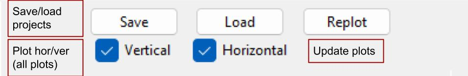
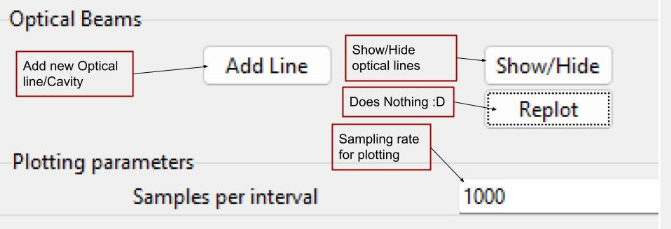
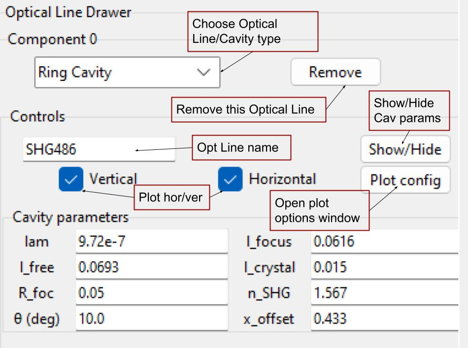
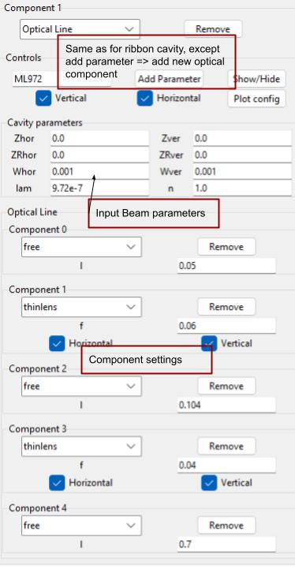

# GUI docs

Raw pictures in `GUI_pics/`.

Full image of the GUI with sample state HRG486MM loaded

The uppermost portion of the sidebar holds the Save/Load buttons to save and load optical line designs. When loading a design from file, one can either overwrite current system or add the designs from the file on top of the current system.

The hor/ver checks control whether the whole plot includes horizontal/vertical beam lines.

Finally, the Replot button updates all plots. The plots do not update automatically to reduce unnecessary calculations, so you need to update manually.

Below the Save/Load buttons one can find the Optical Lines List (LineGUI) controls. The "Add Line" button adds a new optical line item to the list, Show/Hide controls visibility of all optical lines GUI items. The Samples per Interval entry field controls how many samples the plot calculates. 

Note that with the current lazy implementation, this is indeed samples per interval, so the program allots this amount of samples for each free space matrix in your system. So if you have two lenses with three free space matrices in your beamline with 1k samples/interval, the plot takes 3k samples in total. Usually not an issue, but if you decide to make extremely long/complicated beamlines, take heed.

For each optical line item one has common controls; a combobox to choose between different optical beamline types (currently: Ribbon cavity, free optical beamline), a remove button to remove the entire Optical Line, the name of the current optical line (used in plot legend), a show/hide button, checkboxes for whether the program should plot horizontal, vertical or both beamlines for this item, and a "Plot config" button to configure the plot options for the current item (currently just plot colours).

The only difference in functionality is that for the cavity items the Show/Hide affects the cavity parameters, whereas for the Optical Line items the button affects beamline components, but not the input beam options. Also, the Optical Line items have an "Add parameter" button to add new optical line components.

Input parameter explanations:

Ribbon Cavity:
- lam = Wavelength (m)
- l_free = Cavity flat mirror separation (free arm)
- l_focus = Cavity curved mirror separation (focus arm)
- l_crystal = SHG crystal length (Set to 0 if none)
- n_SHG = SHG crystal refraction index
- R_foc = Radius of curvature of focus mirrors
- θ = 2x mirror incidence angle (degrees)
- x_offset = x_offset of cavity, adjust to align to beam focus.

For physical meaning, see:
[cavityparams](GUI_pics/cavity_params.jpg)

Optical Line Input Beam:
- Zhor/ver = +-distance from beam waist
- ZRhor/ver = Rayleigh length
- Whor/ver = Beam waist (Half diameter)
- lam = Wavelength
- n = Refraction index of medium (Should usually be 1) 